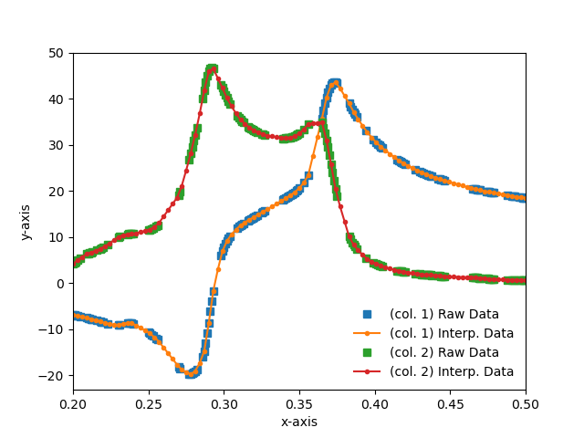

# icurve
A program for Interpolating curve. **icurve** is designed to support multiple columns in Data File.


<p align="center">Dielectric functions of Silicon in UV to Visible region [Ref: E. D. Palik, Handbook of Optical Constants in Solids (Academic Press, 1997].</p>

# Prerequisites

* Python 3
* matplotlib, scipy, pandas, numpy
* argparse

# Usage guide
**icurve** operates as a command line tool with the following sub-commands:

```python
python /path/to/icurve.py -f=sample.dat -s=1 -xmin=1 -xmax=5 -n=101 [-k=linear] [-p=yes]
```
sub-command | short-code | description
---|---|---
help | h |  Help for sub-command
filename |f, file | <span style="color:red">[**Required**]</span> Filename 
skiprows | s, skip | <span style="color:red">[**Required**]</span> Number of lines to skip at the start of the file. This function will be used to ignore comment lines or header. 
xmin | xmin | <span style="color:red">[**Required**]</span> Minimum value of x for interpolation. 
xmax | xmax | <span style="color:red">[**Required**]</span> Maximum value of x for interpolation. 
npoints | n | <span style="color:red">[**Required**]</span> Number of points for interpolation. 
kind | k | <span style="color:blue">[**Optional**]</span> Specifies the interpolation method. <span style="color:blue">**Default: linear**</span>. Options: linear, nearest, zero, slinear, quadratic, cubic, previous, next. 
plot |p | <span style="color:blue">[**Optional**]</span> Plot the raw data vs. interpolated data. <span style="color:blue">**Default: No**</span>. Options: {Yes, Y, True, T, 1}, {No, N, False, F, 0} 

# Reference
https://docs.scipy.org/doc/scipy/reference/generated/scipy.interpolate.interp1d.html

